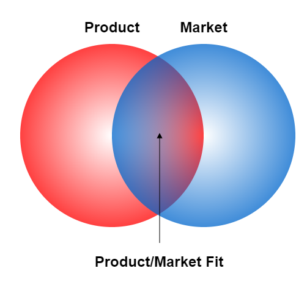
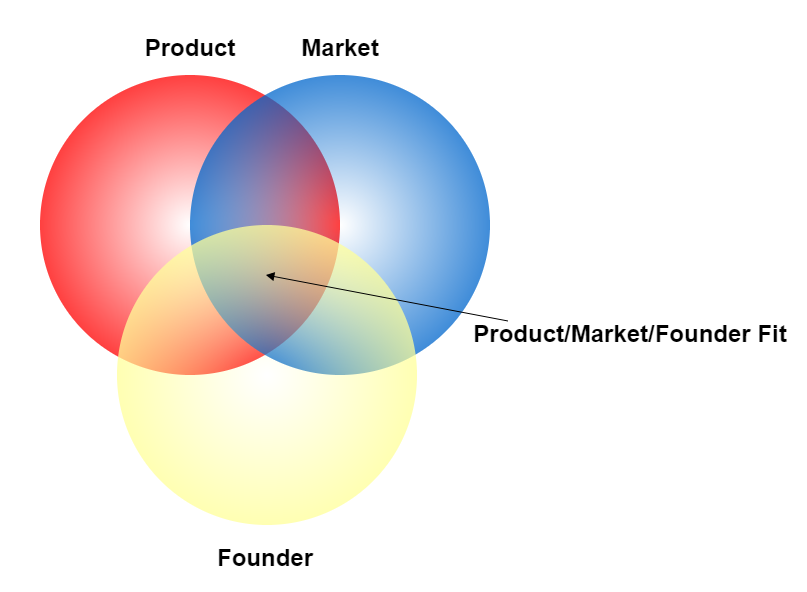

I reject the myth of the creative genius - the idea that it takes a special kind of person to generate ideas for businesses, products, and inventions. The ability to come up with ideas is a skill that can be learned and practiced. I came to this realization after spending a good deal of time thinking about what makes a good business idea and testing some of my own. I have read a lot of books on or related to the topic, talked to successful entrepreneurs and asked them how they came up with their ideas and tested out different methods of idea generation. As I am deciding what kind of business to start next, and am faced with the task of coming up with a tech business idea that may consume the next 3-7 years of my life, I really want that idea to be a good one. When generating business ideas, there are some different frameworks that I use to focus my thinking in a way that allows me to generate more ideas. For idea generation, my goal is quantity, because I feel that I am using one part of my brain to generate ideas and another to judge/prune/filter out the bad ideas. At first, I use a few different "frameworks" to generate ideas. Later after some time has passed, I go back and look at my ideas to filter them. But what makes an idea good or bad?

## Product/Market/Founder Fit

A lot has been written about the idea of product market fit, but not too much on a concept that I find is even more useful for determining what makes a good business idea - Product/Market/Founder fit. Product/Market fit looks like this:

Product market fit is defined by [Marc Andreesen](https://web.stanford.edu/class/ee204/ProductMarketFit.html):

> “Product/market fit means being in a good market with a product that can satisfy that market”.

At the idea generation phase of a tech business, it is important to keep this concept in mind because finding product market fit is the key to building a successful business. The concept is simple enough to understand but it is harder to achieve in practice. I think of an idea as a first guess at what the product and market will be, not just what the product will be. The "first guess" part is important. Very few if any entrepreneurs have a complete vision of their product or business at the very beginning, and have to course correct as they go along.

It is helpful to overlay another layer onto this Venn diagram that represents the founder or founding team, which changes the picture to this:

When generating ideas it is important for me to consider what I am interested in doing, and also what skills, talents, connections, and experience I have that will allow me to be successful implementing my idea where other people will fail. I want to choose a business idea where my unique perspective will allow me to have the most impact.

What I am shooting for is an idea for a product that I have the skills, resources, and interest to build that satisfies the needs of a clearly defined market that I, myself belong to.

It is hard to find a good fit of all three of these areas, so I often start with one of the three and then see if there is an overlap with the other two.

Having explained this idea of Product/Market/Founder fit, I will now explain some of the frameworks that I use to generate ideas.

##Idea Generation Frameworks:

### Idea Generation as a Skill

A few months ago, read a blog post by James Altucher that asserted that idea generation was a skill that can be practiced by anyone. The post is titled ["The Ultimate Guide for Becoming an Idea Machine"](http://www.jamesaltucher.com/2014/05/the-ultimate-guide-for-becoming-an-idea-machine/). The basic premise of the post is that anyone can become good at coming up with ideas by writing down ten ideas per day over the course of several months. So after reading the post, I thought I'd give it a try for 6 months and see what the results were.

I have not been able to write down 10 ideas per day. It sounds easy, but somehow there is the occasional day where I can not carve out the 10 minutes to complete the exercise, or I can not garner the mental willpower to do it. Despite this, about 4 months in, I have been able to come up with more ideas than I have in the past, so I think the technique is a good one. The great thing about this technique is that I can focus in on any of the 3 "targets" or circles on the Product/Market/Founder fit Venn diagram. To come up with ideas for founder fit, I write a list of "10 Ideas of Skills that I Have", or "10 Ideas of Things That I am Interested In". From there I can expand to find overlap within the two other targets. I can also generate ideas starting with the market or product targets as well.

### What problems do you have in your life?

This is a classic idea framework that is often used in the startup world. I do not think that the only way to start a business is to solve some problem. Counterexamples include any game or entertainment business. Regardless, this is a useful framework because solving a problem for someone is a good first step towards establishing both a product and a market. By solving a problem that you have in your own life, you are also likely in the realm of good founder fit.

### What software makes you angry to use? Replace it.

Anytime I am using software that generates anger, I think that writing a replacement would be a plausible business idea. This is often the moment that I am most open to trying competitors to the software I am using.

### What are you spending insane amounts of money on?

I got this framework from Tim Ferris. He started BrainQUICKEN by looking at his credit card statements and realizing that he was spending an insane amount of money on sports supplements.

### What are people asking you for?

This one is from Derek Sivers. He started CD Baby after helping his friends sell their CDs online. He only started the company after many people approached him asking if he could sell their CDs too.

### What type of person do you want to get coffee with every day?

I got this market first framework from an entrepreneur named Jack Zerby. With the assumption that you will spend a lot of time talking to your customers for customer discovery purposes, why not choose to spend time with the type of people you enjoy?

### What are you excited to work on?

This is founder first framework focuses on finding the thing that you are most excited to work on. My first company Yosuatreegames, grew out of me working on mobile games for fun, so in a way, I have used this framework before. I think the pitfall here for me is that I enjoy programming most types of software, and I will be excited to build any application even if there is no market for it.

### What are people searching for on Google?

This framework is something that I see on [r/Entrepreneur](https://www.reddit.com/r/Entrepreneur/) a lot. The idea is to find a set of keywords that have a high search volume but are not that competitive, indicating that there is an unmet market need. One advantage of this approach is that it has built-in channels that you can work toward optimizing - Google Adwords, and SEO.

### Filtering Product Ideas

Using techniques like these, I am able to build a substantial list of ideas, most of which are bad, but a few of which might be the start of a plausible tech business. I then judge each of the ideas on how well they fit the target of Product/Market/Founder fit as well as some personal criteria that I have for a business. In the end, the idea for a business is only part of the outcome, but it is an important part.

_If you enjoyed this post, please subsribe to my [newsletter](http://eepurl.com/c8xBc9)._
