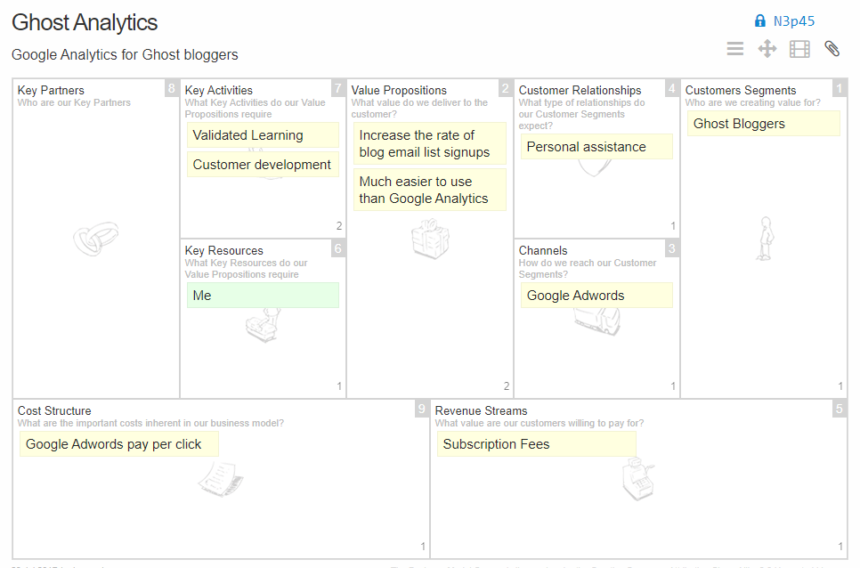
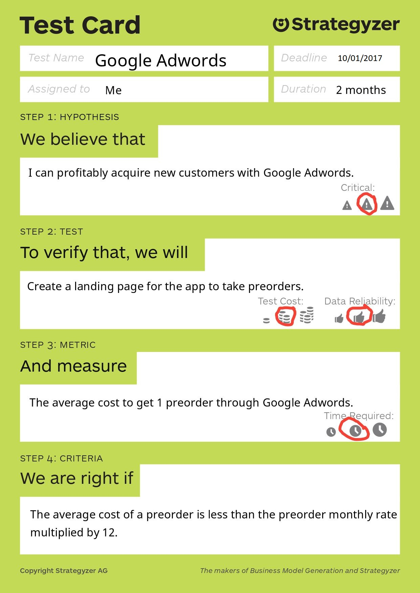
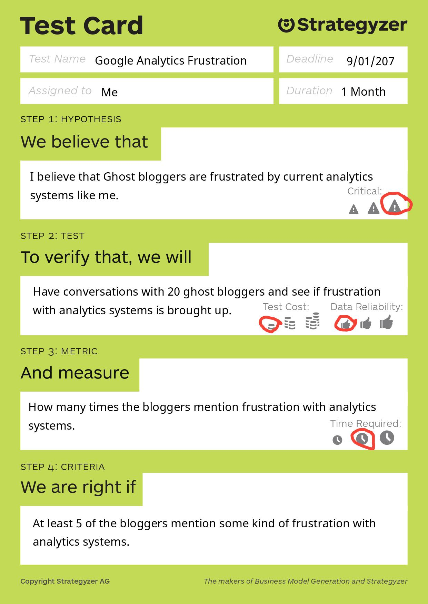

This post is a response to a reader's question. The question was along the lines of "I have an idea, how do I start it?". When I was in college, people would ask me similar questions about how to start a tech business. It is hard to give a quick answer to that question without having a long conversation about why they want to start the business, what their idea is, and what their background is. While every situation is different, I do think that there is a general framework that most people can adapt that serves as a good starting point for 90% of people that want to start a tech business. That general approach is called the Lean Startup Approach, and it was pioneered by Steve Blank, Eric Ries, Alex Osterwalder, and others. It has since turned into a movement with Entrepreneurs around the world using this framework to build startups.

I don't have too much authority on this subject because I have never had any real level of success building startups, but I do [have some experience working on startups](http://www.ryanyosua.me/the-most-important-thing-i-learned-from-publishing-5-mobile-apps/) and am happy to share what I learned from that experience.

## What is the Lean Startup Approach?

To understand what the Lean Startup Approach is, it is first necessary to understand what a startup is, what makes a lean startup different. Let's first look at some definitions:

> “A startup is a human institution designed to create a new product or service under conditions of extreme uncertainty.” - [Eric Ries](http://www.startuplessonslearned.com/2010/06/what-is-startup.html)

> "A startup is an organization formed to search for a repeatable and scalable business model." - [Steve Blank](https://steveblank.com/2010/01/25/whats-a-startup-first-principles/)

> "A startup is a company designed to grow fast." - [Paul Graham](http://www.paulgraham.com/growth.html)

The two common characteristics from these three definitions are **uncertainty** and **growth**. These definitions of startups are a bit vague and do cover a large variety of new businesses started. Most of the time, if you are building an app or a website your business has a high potential for growth because tech products are easily scaled if the demand is there. While the Lean Startup approach has the word "startup" in it, it can be applied more generally to any tech business that has to overcome some level of uncertainty in the beginning. To me, the problem that the Lean Startup approach addresses is the problem of uncertainty rather than the problem of trying to grow a business that is working to the next level. They often go hand in hand, but occasionally an entrepreneur wants to keep their business small in order to create a certain type of lifestyle. The Lean Startup approach works just fine for this type of entrepreneur as well.

### Advantages of a Lean Startup

The advantage of using the Lean Startup approach is to minimize wasted time and effort building your business. The approach minimizes the chance that you will build something that no one wants which is the [most common reason that startups fail](https://www.cbinsights.com/research-reports/The-20-Reasons-Startups-Fail.pdf). A lot of startups don't realize that people don't want what they are building until after they have launched their product. At this point, they have already spent a ton of time and effort building their product which has been wasted. Using the Lean Startup approach, entrepreneurs avoid this problem by identifying their riskiest assumptions first and set out to validate those assumptions. Inevitably some of those assumptions are proven false. This gives the entrepreneurs a chance to change course before they have even started building a product. The Lean Startup method gives entrepreneurs a framework to rely on which allows them to make decisions based on data and observations instead of pure intuition and guesswork.

## The Lean Startup Method in Action

To illustrate what this process I am going to take one of my ideas from my idea list and talk about what it would look like to start working on this idea today.

### The Idea

[The Lean Startup](https://smile.amazon.com/Lean-Startup-Entrepreneurs-Continuous-Innovation/dp/0307887898/) does not say too much about the process of coming up with startup ideas. Fortunately, I covered my own process in a previous post titled [How I Come Up With Tech Business Ideas](http://www.ryanyosua.me/how-i-come-up-with-tech-business-ideas/). For this post, I'll use an idea of my own.

The idea that I will use as an example is something I will call Ghost Analytics. The idea of Ghost Analytics is to create an analytics SaaS product for Ghost bloggers. Ghost is a blogging platform that is a lot like Wordpress but is designed to have a more minimalist design and to focus on blogging rather than be a full-fledged content management system or website builder. I am a big fan of Ghost, and use it to host this blog.

I like this product idea because it is something that I want pretty badly for myself. I currently use Google Analytics but would like something that is simpler and more tailored to blogging. Ideally, I could set it up, by turning on the tracking in the Apps section of the Ghost admin page, and then create an account on the web page and log in. Ghost has a much smaller market share of blogs than something like Wordpress or Weebly, so in the beginning, I would be able to offer the product to a small niche without having to fight off much competition. Later if the company grows, I could expand to Wordpress and other blogging platforms.

### Start With Assumptions

After coming up with an idea, the next step is to write down your assumptions about your business model and order them by how critical they are to the business. In other words list assumptions at the top that would sink the business if you found out that they were false. These assumptions should be in the format "We/I believe that" and then your assumption. We will use these later when we start testing. Here is an example of some assumptions for the idea that I shared above:

1. I believe that Ghost bloggers are frustrated by current analytics systems like me.
2. I believe that by creating a targeted Ghost Analytics system, I can help customers grow their email lists.
3. I believe that I can profitably acquire new customers with Google Adwords.

Assumption #1 is important because if ghost bloggers are already happy with Google Analytics and other tools, then they will have little incentive to pay money to use a better solution. Assumption #2 is testing something called a value hypothesis because it is an assumption about the value proposition of the business. Most bloggers have a goal of growing their email list because it is a key metric to success in blogging. If my analytics product cannot help my customers achieve that goal than I would consider the product a failure. Even if people use it, I will be able to tell that the product is not providing value. Assumption #3 is about a channel that I think I can use to reach potential customers. This is very important because, without customers, there is no business.

### Creating a Problem Statement

Earlier I said that most startups fail because they build something that no one wants. One way to address this issue is to make sure that you are solving a real problem that someone has. Creating a problem statement is a way to force yourself to define the problem that you are solving, and the type of customer that you are solving it for in a really clear way. Here is a template for a problem statement:

    I am a [describe a member of your target customer segment].
    I am trying to [outcome that your customer is trying to achieve].
    But I [problem the customer is facing].
    Because I [underlying problem the customer is facing].

In the Ghost Analytics example the problem statement might look something like this:

    I am a ghost blogger.
    I am trying to grow my email list.
    But I can not get more than a few signups per month.
    Because I do not know how to drive traffic to my blog.

If there are really ghost bloggers out there with this problem, an analytics solution would help them by showing which of their current channels are most effective, and by suggesting possible channels where they could share their blog based on other customers' patterns of success and failure. If I find when talking to customers that they are not having this problem, then I have to change course because this problem statement is fundamental to the business.

### Creating a Business Model Canvas

Now that we have some assumptions, we are ready to start creating a picture of our business model using the business model canvas (BMC for short) as a tool. The idea of a BMC is to replace the role of a formal business plan to document your business strategy at a high level. Lean Startup entrepreneurs like the BMC because it is a more lightweight way to document business strategy. When you create a BMC, you assume that some of your assumptions may be wrong and will need to be changed. Instead of having a business plan that no longer matches your direction, you can make a few quick changes to your canvas to adjust course. Here is an example of a BMC for the Ghost Analytics idea:

The most important parts of the BMC to pay attention to in the beginning are the "Customer Segments" and "Value Propositions" sections. When you create a value proposition that strongly appeals to a particular customer segment, that is called product market fit and is the point at which startups hit an inflection point in the growth of their business. The website that I used to create this is [Business Model Fiddle](https://bmfiddle.com/). The idea is that once you have created the BMC, you go out and use the techniques of validated learning and customer development to verify or disprove your hypotheses. In this example, I color coded the hypothesis yellow for uncertain, and green for confident. If I disproved any of the hypotheses, I would make them red, and then eventually replace them with a new hypothesis to course correct.

### Setting KPIs

A key performance indicator is a metric that tells you whether or not you are making progress. By measuring KPIs you can tell if your business is making progress or it is stagnating. Here are some examples of KPIs I could use to measure the progress of the Ghost Analytics Startup:

- Page views
- Customer retention
- Average lifetime value of a customer
- Landing page email signups
- Preorders
- % month over month growth of customers' own email lists

Something like page views is called a vanity metric because while it might feel good to have a large number of people visiting your web page, maybe these people are the wrong type of potential customers who will never try or buy your product. Something like customer retention is much better. You can measure customer retention using a technique called cohort analysis. The most important KPIs for this example are going to be landing page email signups and preorders. These are KPIs that we can use to start to measure demand before building the actual product.

### Validating Assumptions using Validated Learning

We are finally ready to start testing our hypothesis. To get started we create a test card for one of the hypotheses that we created earlier:

    I believe that I can profitably acquire new customers with Google Adwords.

The test card looks like this:

I created this test card from a template that I downloaded from [Strategyzer](http://blog.strategyzer.com/posts/2015/3/5/validate-your-ideas-with-the-test-card). The idea for this experiment is to create a landing page [MVP](http://scalemybusiness.com/the-ultimate-guide-to-minimum-viable-products/) that will let us measure the demand for the app without actually creating it. Landing pages are very cheap and easy to create. There are plenty of sites where you can use a drag and drop builder to create a page. One of my favorites is [Weebly](https://www.weebly.com/). On the landing page, you can communicate your value proposition and include a button for people to preorder the product. Good news for your customer! Your product is on sale. If they preorder today they will receive a 20% discount on the normal monthly rate. Let's assume we want to charge \$20 a month for the product. When a potential customer clicks the preorder button they go to a page that says:

"Thanks for your interest in Ghost Analytics! This is a brand new product that we are testing market demand for. If you want to be an early adopter and shape the direction of the product, you can lock in the preorder price of \$16 a month which is 20% off what we will charge at launch. You will also get early access to the product and personalized support on how you can use Ghost Analytics to grow your email list. Just share your email here."

Once the landing page is complete, drive traffic to the page using Google Adwords and about $500 - $1000 dollars or whatever you feel comfortable using for the test. For the purpose of the test, we will assume that someone who signs up for the preorder will stay a customer for one year. This is likely an optimistic assumption, so feel free to make it more conservative by assuming that only 20% of the emails you capture will convert.

### Validating Assumptions Using Customer Development

While this test is running for the next two months, we will start customer development, which is really just a fancy term for having conversations with customers (or potential customers) with the goal of learning more about your business. For this example I will use customer development to test the following hypothesis:

    I believe that Ghost bloggers are frustrated by current analytics systems like me.

An example test card for this hypothesis is:

This test is going to give us data that is more fuzzy and open to interpretation than the other test, but it will still be useful. If none of the bloggers mention a frustration with analytics then I might be on the wrong track. It is important to have these conversations in person or on the phone if possible because it gives you a chance to learn about your customers more closely than you could through a survey or by email.

### Build Measure Learn Repeat

There are just two examples of tests that I could run to validate or invalidate this idea. After the tests were done, I would see if there is any useful data that I learned, adjust the BMC, and then create another round of cards to test. Only after I have more confidence in the business model would I start building the actual application. Once the application is built, the tests can go from vague measurements to more scientific A/B testing. Of course, it would take some time until I had enough customers for the tests to be statistically significant, but this type of testing approach makes entrepreneurship less reliant on gut feel. The Lean Startup approach does not work for every entrepreneur or every company, but after using the approach with an app that I developed in the past, I was able to tell that the idea was not going to work within a matter of months. I realized after talking to customers and running tests that we would have to drastically change the business model so much to make it work that we would be essentially starting over and decided to abandon that idea. Whether or not to persevere or give up on an idea is one of the hardest decisions to make as an entrepreneur. For us, the decision was still hard, but it was made easier by the fact that almost every one of our hypotheses was proven wrong. If we had ignored this approach we would have taken a much more difficult route of spending all of our time and effort in building features in the app, when our target customers did not see it as a solution to their problem in the first place.

_If you enjoyed this post, please check out the new decentralized social network that I am building at [fragmented.world](http://www.fragmented.world/)._
