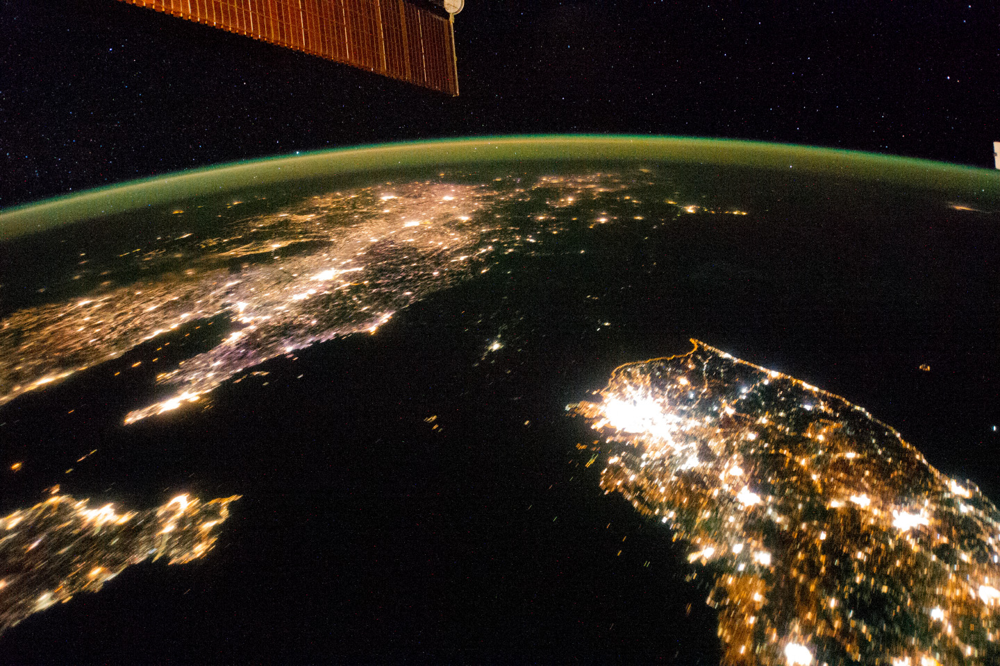

When most people hear about seasteading the first time they dismiss it as a crazy idea. Seasteading is building floating cities on the ocean. On the surface, it sounds crazy, and it is not clear at first why anyone would want to live on an artificial floating island. But when you start to learn more about seasteading, you realize that not only is it possible, but that it is a path to a more prosperous and sustainable future.

<iframe width="560" height="315" src="https://www.youtube-nocookie.com/embed/LwCu4IuSmvc" frameborder="0" allow="autoplay; encrypted-media" allowfullscreen></iframe>

## Why Would Anyone Want to Build a City on the Ocean

While many in the Ethereum community are hearing about seasteading for the first time with the Varyon token sale, seasteading is a movement that the founders of Blue Frontiers and the Seasteading Institute have been working on for a long time. I first heard about seasteading a few years ago. I had always thought that it was an interesting idea, but after reading the book _Seasteading: How Floating Nations Will Restore the Environment, Enrich the Poor, Cure the Sick, and Liberate Humanity from Politicians_ by Joe Quirk and Patri Friedman last year, the benefits of seasteading became clear. In the book, the authors categorize the benefits in three main groups: environment, economy, and freedom.

### Enviroment

The book makes a strong case for seasteads having a positive impact on the environment. The main argument that the book makes for this is that CO2 and nitrogen pollution that is created through traditional farming and industry is exactly what is needed to grow seaweed. The book explains how the people of seasteads could grow seaweed and sashimi as a food source. If you are grossed out by eating seaweed, you can stick to eating sashimi which eats seaweed. And if you don't like sashimi, you can always eat imported food as well. In addition to using seaweed as a food source, it can be used to power the seastead from the oil it produces along with solar and wave power.

### Economy

To illustrate how drastic an effect governance has on the economy the book describes a picture of North and South Korea from space:

It is striking to see the black hole of North Korea standing out at night from space. The authors use this example to illustrate the role that economic freedom has on the prosperity of a country. Seasteads will offer plenty of economic freedom, but in addition to that, they will encourage a kind of political evolution that we have never seen before. People who don't like the politicians that are representing them will be able to "vote with their boat" and move to a seastead that has laws that better match their preferences. Instead of politicians arguing about how much to tax people, they will be forced to compete for citizens by lowering their taxes and using the money that they do collect efficiently to offer the best services they can. If they don't strike a good balance between not taxing too much, or not taxing enough to provide for their citizens, then people will set sail for a better seastead with their friends and family.

### Freedom

Besides economic freedom, citizens of seasteads will have greater personal freedoms as well. Seasteads will need to attract new citizens and will be welcoming to people seeking freedom from oppressive and poor countries.

## How Ethereum Will Help Seasteads

### Varyon Token Sale

Blue Frontiers is conducting an ICO in order to raise money to build the first seastead which they plan on deploying in 2021. The Varyon token is a "general purpose token" that Blue Frontiers will accept exclusively for its products and services. This means that if you want to buy or rent a place to live on their seastead, you have will have to buy Varyon in order to make the payment.

Blue Frontiers will create the first seazone which will be a portion of the ocean that they are legally authorized to build in and inhabit by the host nation of French Polynesia. Eventually, they will create and sell physical platforms for use in the seazone that others can use to create their own seasteads.

In addition to using Varyon to purchase goods and services "holders of Varyon will enjoy opportunities to express opinion about Blue Frontiers activities and consequential decisions".

### New Types of Governance

Seasteads will allow people to experiment with new types of governance directly on Ethereum. While it would be hard to move an existing country like the U.S. to a voting system based on Ethereum, it is extremely likely that new seasteads will naturally use Ethereum for governance.

### The Separation of Money and State

With the first seastead using Varyon, an ERC20 token as their currency, all of the benefits of cryptocurrencies will be assured from the start. The native currency will be digital, decentralized, and free from inflation.

## How Seasteads will help Ethereum

From the whitepaper:

> Blue Frontiers’ aim is to offer cryptographic currencies and blockchain technologies with a legal environment that encourages innovation, rather than undermining it with overregulation. Our SeaZones will offer cryptocurrency users and developers significant latitude for experimentation within a legal framework that provides certainty and protection from hostile regulatory regimes elsewhere.

The seastead will have to provide a friendly legal climate for blockchain companies that will make it an attractive place to found a blockchain company. It will also help Ethereum grow by encouraging citizens of the seastead to use Ethereum as a currency and tool for voting on different policies.

## What About the Pirates and Other Fears

Quirk and Friedman address common concerns about seasteading in their book ranging from pirates to pollution. I won't rehash their arguments here, except to say that pirates only inhabit 2% of the ocean and that they advise not to found a seastead off the coast of Somalia (which happens to be in that 2%).

## The Promise of Seasteading

It will take some time for the long-term benefits of seasteading to be realized. The first seastead that is proposed by Blue Frontiers and that will be built with the funds from the ICO will only be home to 300 people. The vision of building cities and eventually nations on the ocean will take a long time. However, the idea of living on the ocean has so many benefits that it will be very exciting to see how the first seastead turns out. I am hopeful that the Blue Frontiers will accomplish its goal of creating the first floating city.
