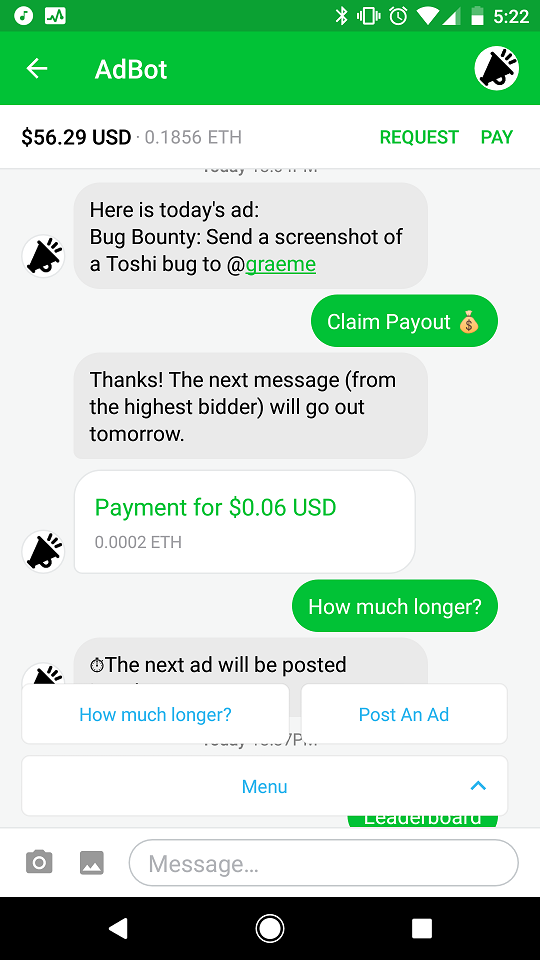
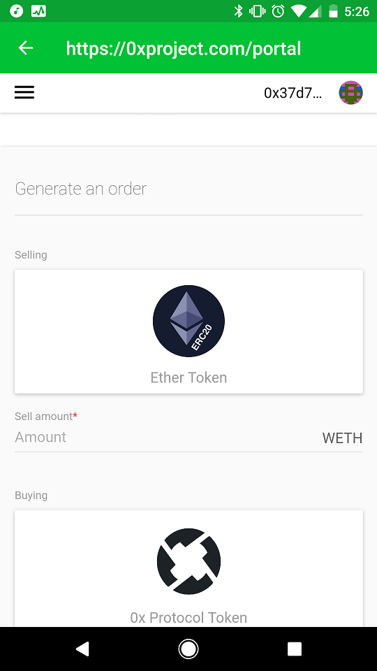

[Toshi](https://www.toshi.org/) the mobile Ethereum wallet developed by Coinbase is finally available on the main Ethereum network. Toshi is open source, user-friendly, and offers a number of features that make it much more than just an Ethereum wallet.

## Toshi as a Wallet

Toshi works great as an Ethereum wallet. You can create a wallet on Toshi, and unlike the Coinbase app, you control your private key. This means that you truly own the Ether that you hold on the wallet, and are empowered and responsible to backup and safeguard your money. If you want to, you can import your seed into another wallet like MyEtherWallet, and you can also view your balance on a block explorer like Etherscan. In other words, it is a real wallet and not a portal to your Coinbase account. Besides the basic features you would expect from a wallet, you can also request a payment in a Venmo-like way from another user.

## Toshi as an App Store

Where Toshi really shines is the ability to create chatbot DApps. AdBot is one of the first three apps that you can use on Toshi and is my favorite. The way AdBot works is this:

- Advertisers can submit a short text-based ad to the chatbot along with a bid
- Once a day the ad with the highest bid is sent as a message to anyone that subscribes to chatbot
- The amount that is bid is split between people who verify by pressing a button that they viewed the ad

One day I received $.03 of Eth from the founder of Coinbase welcoming everyone to Toshi. Another day, I received $.06 from someone working on Toshi asking people to send him a picture message with bug reports for a small amount of Ether. I sent him two small bugs that I found, and he sent me about \$1.50 in Ether as a reward.

AdBot is just a start, and I anticipate many more apps will be deployed on Toshi soon.

## Toshi as a Messaging App

Toshi has built-in end-to-end encrypted chat using the Signal protocol, which lets users talk to each other without leaving the app. The app does not support group chat yet and is pretty simple, but it is cool to have encrypted chat as a feature.

## Tohsi as a DApp Browser

One of the coolest features of Toshi is that it is a DApp Browser. You can use Toshi to interact with any DApp that is live on the Web similar to how you can use Metamask or Mist to view and interact with DApps.

## Conclusion

Toshi is the best mobile Ethereum wallet that I know of, and it does a lot more than just send and receive Ether. Right now it offers an impressive feature set that allows users to interact with chat-based DApps, send encrypted messages, and even use DApps that are already on the web. It is developed by Coinbase but is published as open source software. I am really excited about the future of Toshi, and can't wait to experiment with new apps as they come online, and may even try developing one myself.

If you try Toshi feel free to send me a message in the app. My username is @ryosua.

_Disclaimer - Toshi is great for holding small amounts of ETH, but for larger amounts, you should use something that is much more secure like a hardware or [paper wallet](https://www.callmegwei.com/2017/12/23/crypto-101-paper-wallets/). I recommend [Trezor](https://trezor.io/)._

_If you enjoyed this post, please subsribe to my [newsletter](http://eepurl.com/c8xBc9)._
